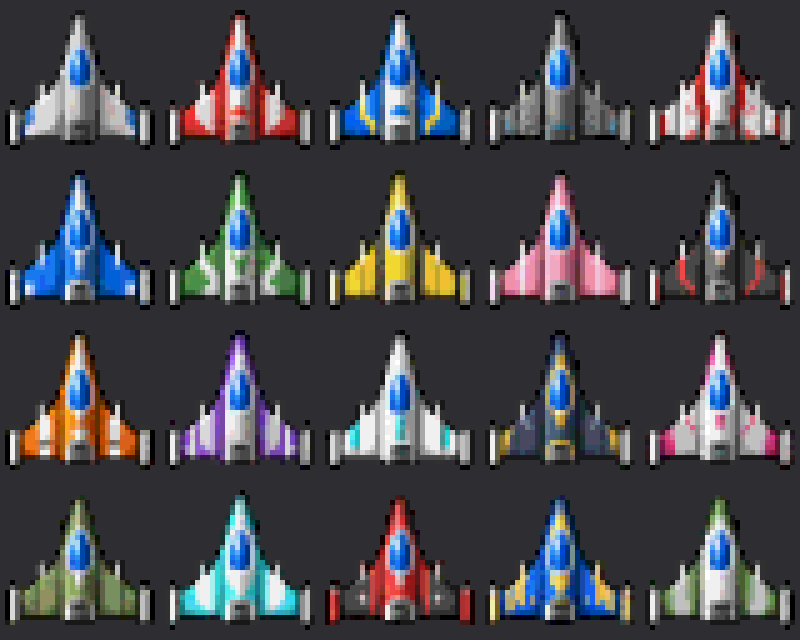

# Pixel Art Converter

高解像度の画像やAI生成のピクセルアート風画像を、32×32などの小さなドット絵へ変換するWindows用C# WinFormsツールです。

**完成版 1.3**

## 機能

- 行列での画像分割と上下左右の入力余白の除外
- 各列の幅・各行の高さを指定する分割
- BOX相当の面積加重縮小とAlphaの二値化
- Color Stepによる色の整理と背景色の透明化
- 共通倍率または機体ごとの拡大縮小
- 輪郭の中心または透明度で求めた重心を使う中央配置
- 実寸・整数倍プレビュー、分割枠とセル番号の表示
- 透明背景のシートPNGと個別PNGの保存

## 起動

Windows 11、.NET 8 SDK、Visual Studioの「.NET デスクトップ開発」を使用します。

1. このリポジトリをクローン、または **Code → Download ZIP** でダウンロードして展開します。
2. `PixelArtConverter.csproj`をVisual Studioで開きます。
3. **F5**で起動します。
4. 「画像を開く」で`samples/sample_input.png`などを選びます。

PowerShellではプロジェクトのフォルダーで実行します。

```powershell
dotnet run
```

## 基本の使い方

1. 入力画像に合わせて「列」「行」を設定します。
2. 出力する1枚の「幅」「高さ」を指定します。
3. 入力余白と列幅・行高で切り出す範囲を調整します。
4. 背景処理、Alpha、Color Stepを調整し、各セルを確認します。
5. 中心合わせ・拡大縮小方式を選び、PNGとして保存します。

初期値は5列×4行、出力32×32、Alpha 48、Color Step 24、出力余白1です。

「列の幅」「行の高さ」は、**余白を除いた位置から各マスのサイズを累積**します。
例：上余白10、行の高さ`32,32,32,32`なら境界は`10,42,74,106,138`です。
全マス分を入力すると後ろの残りを除外します。最後の1マスを省略すると残りの範囲を使い、空欄なら均等分割します。

## マニュアル

- [操作マニュアル PDF](docs/PixelArtConverter_Manual.pdf)
- [操作マニュアル Word](docs/PixelArtConverter_Manual.docx)

## 変換見本



`sample_output.png`は20枚の32×32画像を並べた160×128 PNGです。
この見本は変換の参照実装で生成したもので、設定によって出力は変わります。

## 配布用ビルド

```powershell
dotnet publish -c Release -r win-x64 --self-contained true -p:PublishSingleFile=true
```

出力は`bin/Release/net8.0-windows/win-x64/publish/`に作成されます。

## 対応範囲

列・行は各1～32、出力サイズは各4～128 pxです。
入力は1600万ピクセル以下、出力合計は400万ピクセル以下です。
全ての行で共通の列幅、全ての列で共通の行高を使います。
設定のファイル保存と、アニメーションGIF全体の変換には対応していません。
大きな画像では計算中に操作が一時的に止まる場合があります。

元画像のドット格子を完全に復元する処理ではありません。
中心検出には炎・影・文字など、セル内の不透明部分も含まれます。

## 動作確認

利用者のWindows環境で動作確認済みです。作成環境では.NET SDKが利用できないため、独立したビルド検証は実施していません。
